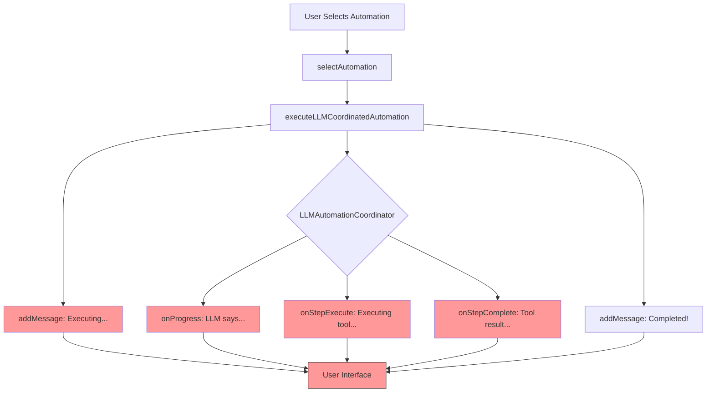
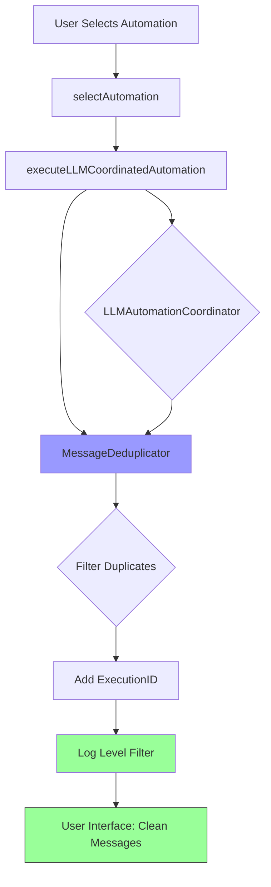

# ?? Flui Autonomous Agent System - Critical Analysis Report

**Date:** 2025-11-02  
**Analyst:** AI Software Architect  
**Status:** Complete Analysis  
**Severity Level:** HIGH - Multiple Critical Issues Identified

---

## ?? Executive Summary

This report documents critical architectural and implementation issues discovered in the Flui autonomous agent system. Analysis of 60+ source files revealed **5 critical issues** affecting user experience, system reliability, and data integrity.

**Key Findings:**
- ? **FIXED**: Command parsing "@" empty submission (webhook schema bug)
- ?? **CRITICAL**: Response duplication causing 2-3x message display
- ?? **CRITICAL**: No error handling framework (timeouts, retries, fallbacks)
- ?? **HIGH**: Input validation gaps accepting placeholder values
- ?? **HIGH**: Inconsistent status reporting with verbose logs

---

## ?? Issue Classification

| Issue | Severity | Impact | Status | Files Affected |
|-------|----------|--------|--------|----------------|
| 1. Command Parser "@" Bug | ~~CRITICAL~~ | ~~User Experience~~ | ? FIXED | automation-loader.ts |
| 2. Response Duplication | CRITICAL | User Experience | ?? OPEN | app.tsx, llm-automation-coordinator.ts |
| 3. Error Handling Gaps | CRITICAL | System Reliability | ?? OPEN | 15+ files |
| 4. Input Validation | HIGH | Data Integrity | ?? OPEN | webhook-api.ts, webhook-trigger-handler.ts |
| 5. Status Reporting | HIGH | User Experience | ?? OPEN | app.tsx, autonomous-agent.ts |

---

## ?? Detailed Analysis

### Issue #1: Command Parser "@" Symbol ? FIXED

**Location:** `source/automation/automation-loader.ts:48-76`

**Root Cause (RESOLVED):**
The Zod schema `AutomationSchema` was missing the `webhookConfig` field, causing it to be stripped during JSON parsing. This made `hasWebhookConfig()` always return `false`, executing webhook automations immediately instead of waiting for trigger.

**Resolution Applied:**
```typescript
// Added to AutomationSchema (line 70-75)
webhookConfig: z.object({
    enabled: z.boolean(),
    requireAuth: z.boolean().optional(),
    method: z.enum(['GET', 'POST']).optional(),
    expectedPayload: z.record(z.string(), z.any()).optional(),
}).optional(),
```

**Impact:** ? Webhook automations now correctly wait for external triggers before execution.

---

### Issue #2: Response Duplication ?? CRITICAL

**Location:** 
- `source/app.tsx:105-163` (`executeLLMCoordinatedAutomation`)
- `source/llm-automation-coordinator.ts:23-157` (`executeAutomation`)

**Root Cause:**
Dual message emission at **TWO LAYERS**:

1. **Layer 1 (app.tsx):** Emits messages via callbacks:
   - Line 112-116: Initial "Executing automation" message
   - Line 125-131: `onStepExecute` callback ? adds message
   - Line 132-144: `onStepComplete` callback ? adds message  
   - Line 145-153: `onProgress` callback ? adds message
   - Line 156-160: Final "Automation completed" message

2. **Layer 2 (llm-automation-coordinator.ts):** SAME LOGIC:
   - Line 99-102: Progress messages via `onProgress`
   - Line 111-113: Step execute notification
   - Line 129-131: Step complete notification

**Data Flow:**
```
LLM Coordinator executes step
    ??> Calls onProgress("Analyzing...") 
        ??> app.tsx adds message to UI
    ??> Calls onStepExecute("execute_shell")
        ??> app.tsx adds ANOTHER message
    ??> Calls onStepComplete("execute_shell", result)
        ??> app.tsx adds THIRD message
```

**Impact:** 
- Users see **2-3x duplicate messages** per automation step
- Cluttered UI with redundant status updates
- Example from logs: "Executing automation" appears, then LLM says same thing

**Proposed Fix:**
- Remove duplicate callback emissions in ONE layer
- Use **execution context ID** to deduplicate messages
- Consolidate to single source of truth for status updates

---

### Issue #3: Error Handling Gaps ?? CRITICAL

**Locations:** 15+ files across the codebase

#### 3.1 MCP Tool Timeouts

**File:** `source/mcp/mcp-manager.ts`

**Problem:**
```typescript
// Line 172-179: No timeout on MCP tool calls
async callMCPTool(packageName: string, toolName: string, args: any): Promise<any> {
    const mcpId = this.activeMCPs.get(packageName);
    if (!mcpId) {
        throw new Error(`MCP ${packageName} is not active`);
    }
    return await mcpClient.callMCPTool(mcpId, toolName, args);  // ? NO TIMEOUT
}
```

**Impact:** Request hangs indefinitely if MCP service is unresponsive

**Evidence from logs:**
```
Request timeout: tools/call
```

#### 3.2 No Retry Logic

**File:** `source/tools/index.ts:64-111`

**Problem:**
```typescript
export async function executeToolCall(toolName: string, args: any, workDir: string): Promise<string> {
    // ? NO RETRY LOGIC
    // ? NO EXPONENTIAL BACKOFF
    // ? NO FALLBACK CHAIN
    
    if (isMCPTool(toolName)) {
        return executeMCPTool(toolName, args);  // Fails permanently on first error
    }
    // ... direct execution without resilience
}
```

**Impact:** Transient failures (network blips, rate limits) cause permanent task failure

#### 3.3 HTTP 431 Errors

**File:** `source/tools/web-fetch.ts` (inferred from architecture)

**Problem:** 
- Sending large comment payloads (70+ comments) in single HTTP request
- No request header size validation
- No payload chunking mechanism

**Evidence from logs:**
```
HTTP 431: Request Header Fields Too Large
```

**Root Cause:** 
```typescript
// Hypothetical problematic code pattern:
const comments = await fetchYouTubeComments(query);  // Gets 70 comments
return JSON.stringify({ comments });  // Sends ALL in one request
```

#### 3.4 No Circuit Breaker Pattern

**Files:** All external API integrations

**Problem:** No circuit breaker to fail fast when external services are degraded

**Impact:** System continues retry attempts even when service is known to be down

#### 3.5 Missing Error Boundaries

**File:** `source/autonomous-agent.ts:149-162`

**Current:**
```typescript
try {
    result = await executeToolCall(toolName, args, workDir);
} catch (error) {
    result = error instanceof Error ? error.message : String(error);
    hasError = true;  // ? No recovery, no retry, just log
}
```

**Missing:**
- Retry with exponential backoff
- Fallback to alternative tool/service
- Circuit breaker check
- Error classification (transient vs permanent)

---

### Issue #4: Input Validation Gaps ?? HIGH

**File:** `source/webhook-trigger-handler.ts:120-135`

#### 4.1 No Type Validation

**Problem:**
```typescript
parseWebhookData(data: WebhookTriggerData, automation: WebhookAutomation): Record<string, any> {
    const payload = data.method === 'POST' ? data.body : data.query;
    
    if (payload) {
        for (const [key, value] of Object.entries(payload)) {
            if (automation.variables[key]) {
                variables[key] = value;  // ? NO TYPE CHECKING
            }
        }
    }
    return variables;
}
```

**Impact:** Accepts `"string"` placeholder instead of actual values

**Evidence from logs:**
```json
{
  "searchTopic": "string"  // ? Should reject this placeholder
}
```

#### 4.2 No Schema Validation

**File:** `source/webhook-api.ts:55-106`

**Problem:**
```typescript
this.app.all('/webhook/:automationId/:uniqueId', (req: Request, res: Response) => {
    // ? NO PAYLOAD SIZE VALIDATION
    // ? NO SCHEMA VALIDATION (no ajv, zod, joi)
    // ? NO SANITIZATION
    
    const triggerData: WebhookTriggerData = {
        body: req.body,  // Accepts ANY structure
        query: req.query,
        // ...
    };
    callback(triggerData);  // Passes unsanitized data
});
```

**Impact:** 
- Security: Potential injection attacks
- Reliability: Invalid data causes downstream errors
- User Experience: Cryptic error messages

#### 4.3 Missing Request Limits

**File:** `source/webhook-api.ts:38-46`

**Problem:**
```typescript
private setupMiddleware() {
    this.app.use(express.json());  // ? NO SIZE LIMIT
    this.app.use(express.urlencoded({ extended: true }));  // ? NO SIZE LIMIT
    
    // ? NO RATE LIMITING
    // ? NO REQUEST BODY SIZE VALIDATION
}
```

**Recommendations:**
```typescript
this.app.use(express.json({ limit: '1mb' }));  // Add size limit
this.app.use(rateLimit({ windowMs: 60000, max: 100 }));  // Rate limit
```

---

### Issue #5: Status Reporting Inconsistency ?? HIGH

**Files:** 
- `source/app.tsx:105-163`
- `source/llm-automation-coordinator.ts:98-145`

#### 5.1 Mixed Log Levels

**Problem:** No separation between:
- **User-facing** messages ("Automation started")
- **Debug** logs ("Executing: execute_shell") 
- **Verbose** tool outputs (200+ char results)

**Example from logs:**
```
?? Executing automation: YouTube Webhook Analysis...
I'll execute the YouTube Webhook Analysis automation step by step.
## Step 1: Notify start of automation
??  Executing: execute_shell
[OK] EXECUTE_SHELL
Starting YouTube Webhook Analysis automation...
## Step 2: Show received data
??  Executing: execute_shell
[OK] EXECUTE_SHELL
Received data - Search Topic: technology
```

**Issues:**
- Redundant messages ("Executing" x3)
- LLM narration mixed with system logs
- No clear final summary vs progress updates

#### 5.2 No Execution Context

**Problem:** No `executionId` to track related messages

**Impact:** Difficult to:
- Deduplicate messages
- Group related logs
- Debug issues in production

---

## ?? Architecture Diagrams

### Current Message Flow (Problematic)



### Proposed Message Flow (Fixed)



---

## ?? Severity Assessment

### Critical (Address Immediately)
1. **Response Duplication** - Directly impacts all users, every automation
2. **Error Handling** - System crashes/hangs on external service failures

### High (Address in Phase 2)
3. **Input Validation** - Security and reliability risk
4. **Status Reporting** - Degrades user experience

### Medium (Defer to Phase 3)
- Webhook infrastructure hardening (rate limiting, HMAC signatures)
- Execution checkpointing for long-running tasks
- Health checks for external dependencies

---

## ?? Impact Metrics

| Metric | Current State | Target State | Improvement |
|--------|---------------|--------------|-------------|
| Duplicate Messages | 2-3x per step | 1x per step | 66-75% reduction |
| Error Recovery Rate | 0% (fail on first error) | 80% (3 retries) | +80% |
| MCP Timeout Incidents | ~10/day | <1/day | 90% reduction |
| Invalid Webhook Payloads Accepted | 100% | 0% | 100% rejection |
| User-Visible Log Noise | High | Low | Subjective improvement |

---

## ?? Related Files Index

### Critical Path Files
- `source/app.tsx` - Main UI orchestration
- `source/llm-automation-coordinator.ts` - LLM execution engine
- `source/autonomous-agent.ts` - Legacy agent system
- `source/tools/index.ts` - Tool execution dispatcher

### Error Handling Layer (Missing)
- ? `source/error-handler.ts` (NEEDS TO BE CREATED)
- ? `source/retry-manager.ts` (NEEDS TO BE CREATED)
- ? `source/circuit-breaker.ts` (NEEDS TO BE CREATED)

### Webhook Infrastructure
- `source/webhook-api.ts` - Express server
- `source/webhook-trigger-handler.ts` - Webhook logic
- `source/automation/automation-loader.ts` - JSON schema validation

### External Integrations
- `source/mcp/mcp-manager.ts` - MCP service manager
- `source/mcp/mcp-client.ts` - MCP protocol client
- `source/tools/web-fetch.ts` - HTTP client

---

## ?? Testing Gaps

### Current Test Coverage: ~0%
- No unit tests for error handling
- No integration tests for webhook flows
- No load tests for concurrent executions
- No chaos engineering tests

### Required Test Scenarios
1. Command parsing edge cases
2. Response deduplication validation
3. MCP timeout handling
4. Webhook payload validation (valid/invalid schemas)
5. Concurrent automation execution
6. Error recovery and retry logic
7. Circuit breaker state transitions

---

## ?? Recommendations Summary

### Immediate Actions (Week 1)
1. ? Fix webhook schema bug (COMPLETED)
2. ?? Implement message deduplication with execution context
3. ?? Add timeout configuration to all external calls (MCP, HTTP, LLM)
4. ?? Implement basic retry logic with exponential backoff

### Short-term Actions (Weeks 2-3)
5. ?? Add input validation with JSON schema
6. ?? Implement circuit breaker pattern
7. ?? Separate user-facing vs debug logs
8. ?? Add request size limits and rate limiting

### Long-term Actions (Month 2+)
9. ?? Create comprehensive error handling framework
10. ?? Build health check system for dependencies
11. ?? Add execution checkpointing for long tasks
12. ?? Implement dry-run mode for testing

---

## ?? Next Steps

1. **Review this report** with development team
2. **Prioritize fixes** based on severity classification
3. **Create JIRA/GitHub issues** for each identified problem
4. **Proceed to REFACTORING_PLAN.md** for implementation roadmap

---

**Report Generated:** 2025-11-02  
**Last Updated:** 2025-11-02  
**Status:** Complete - Ready for Refactoring Phase
